# Match Review Autopilot

A [Devvit](https://developers.reddit.com/) app that automates post-match player ratings for football team subreddits — lineup voting, Reddit love, Man of the Match, and season-long **Player of the Month / Season** awards.

**Production:** hands-off autopilot (sync → open at kickoff + 120 min → close → aggregate → publish awards).  
**Demo:** mod menu can manually stagger posts into the mod queue for playtesting.

---

## Table of contents

- [What it does](#what-it-does)
- [Architecture](#architecture)
- [Media upload](#media-upload)
- [Mod menu](#mod-menu)
- [Scheduler](#scheduler)
- [Setup](#setup)
- [Project structure](#project-structure)

---

## What it does

- **Post-match voting** — Interactive custom posts: 5-star ratings, Reddit love credits, Man of the Match (crown).
- **Results dashboards** — Post-match and full-screen period dashboards (POTM, Most Loved, POTSeason).
- **Intelligent scheduling** — Devvit Scheduler for publish/close jobs and lifecycle ticks; failed steps skip/retry without blocking the pipeline.
- **Incremental aggregation** — Compact Redis aggregates merge into month/season rollups as each match closes.
- **Team setup** — Mod enters **team name** on install; SportMonks search resolves the club ID.
- **Media on Reddit** — Player headshots and team logos uploaded via `media.upload()` so webviews render reliably.

---

## Architecture

### System overview

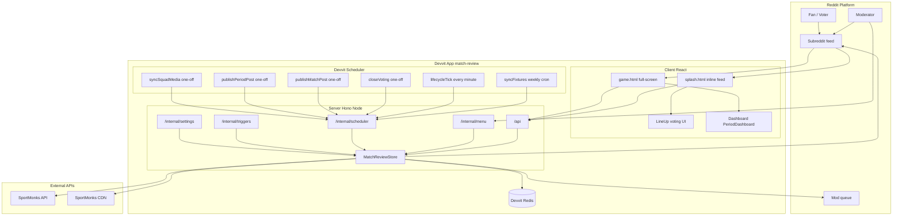

### Install and team connection

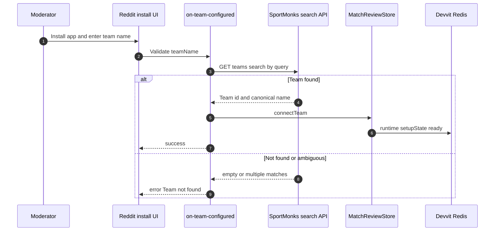

### Production autopilot vs demo scheduling

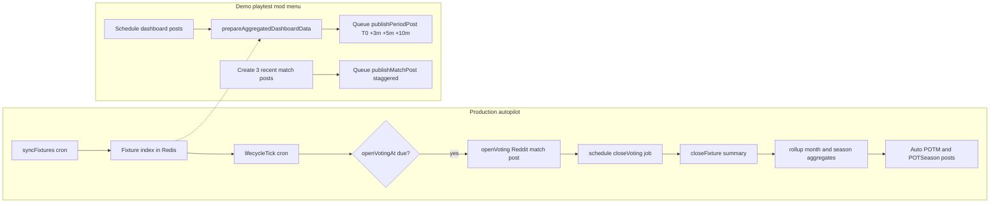

### Match lifecycle

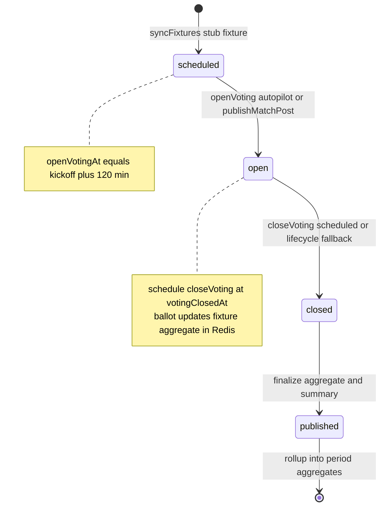

### Aggregation pipeline

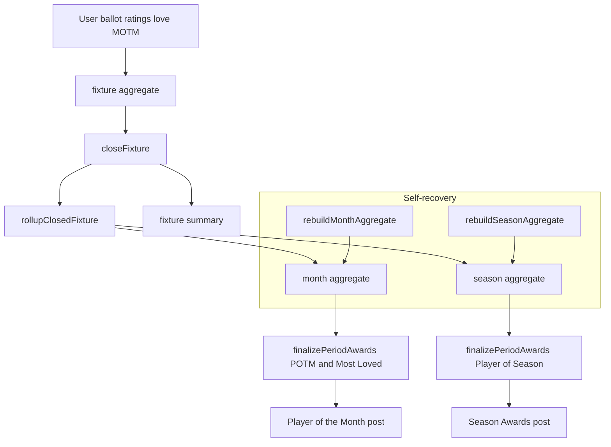

### Redis data model simplified

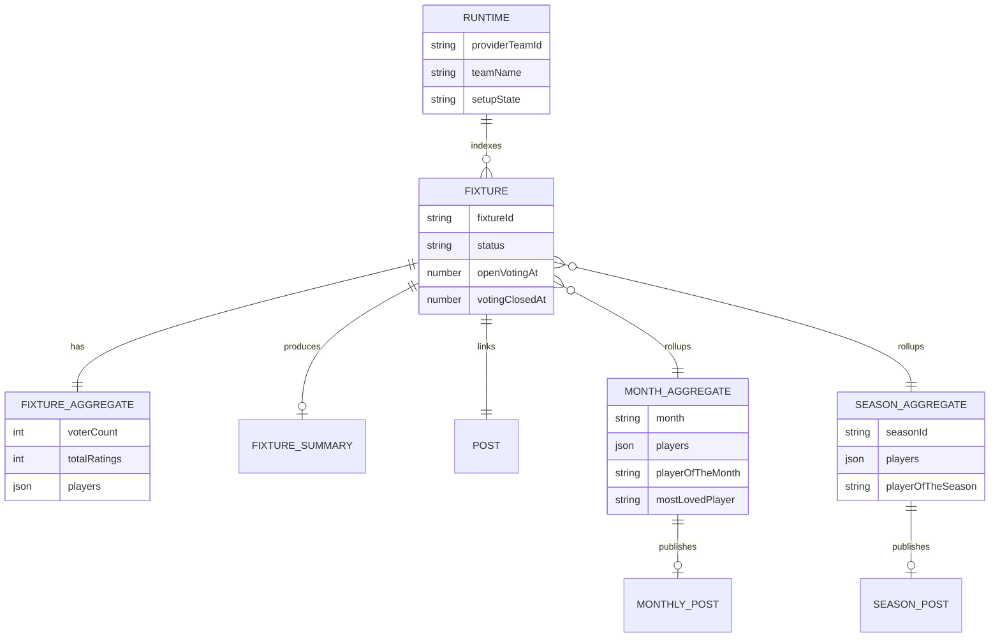

### API efficiency

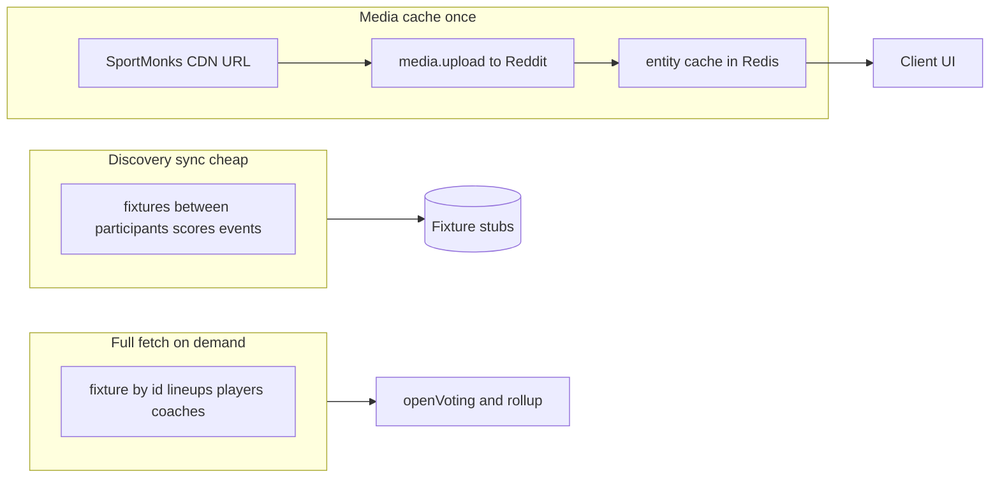

### Scheduler job map

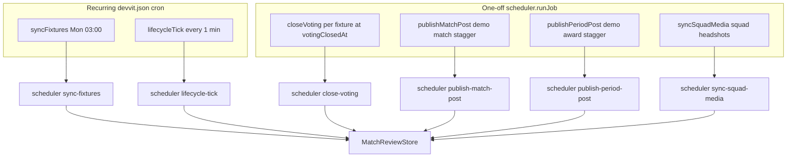

### Client entrypoints

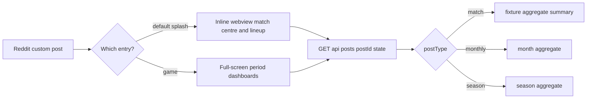

---

## Media upload

Devvit webviews cannot reliably load external CDN URLs. Images from SportMonks are uploaded to **Reddit via `media.upload()`**, cached in Redis, and only Reddit-hosted URLs are sent to the client.

### Why

| Problem | Solution |
|--------|----------|
| SportMonks CDN blocked or flaky in webview | Upload once to i.redd.it or redditmedia.com |
| Same player or team image across many fixtures | Entity cache in Redis upload once per entity |
| Squad sync is slow | Background scheduler job plus 24h resync skip plus lock |

### Media flow

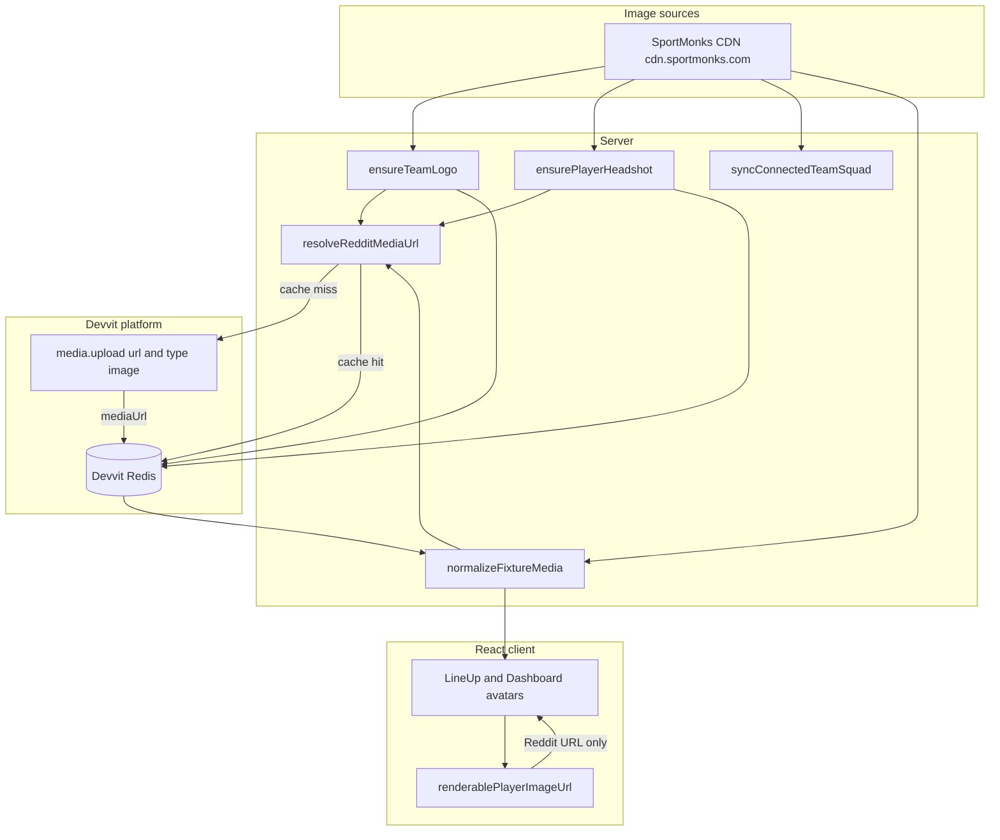

### Upload and cache logic

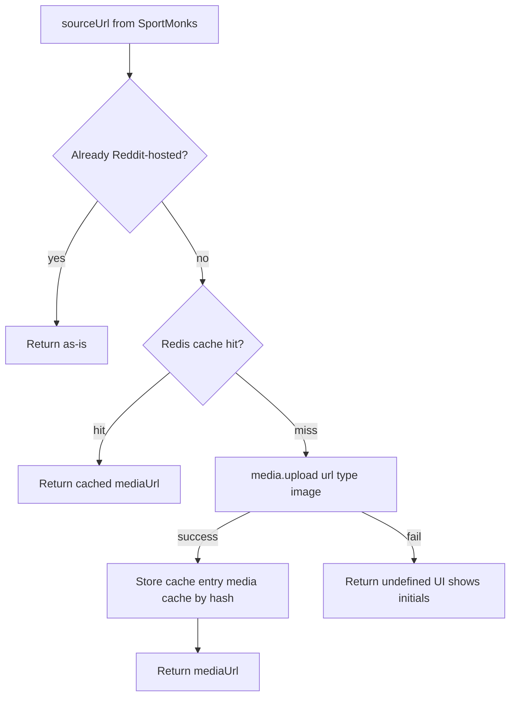

### Entity cache team and player

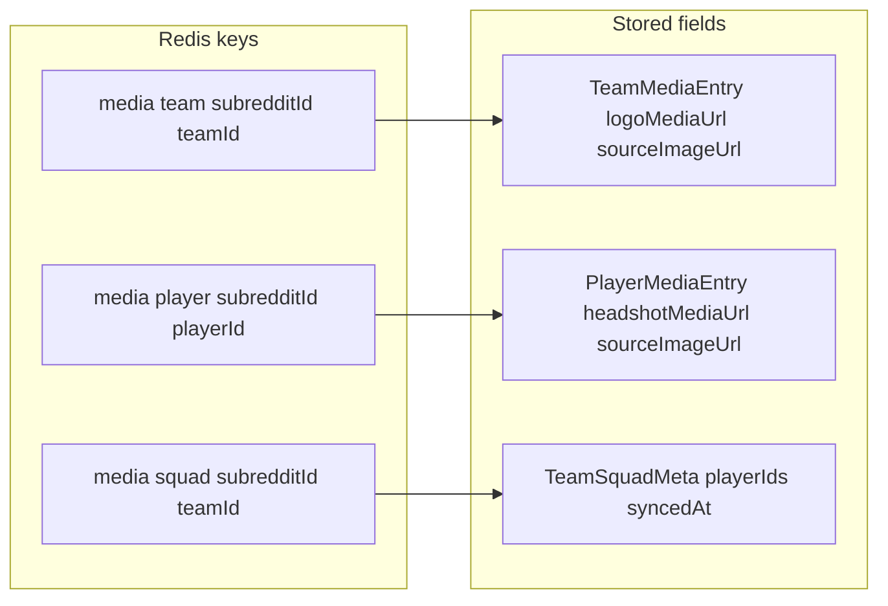

**ensureTeamLogo / ensurePlayerHeadshot logic:**

1. If entity entry already has logo or headshot URL → return it no re-upload.
2. If source URL is already Reddit-hosted → store and return.
3. Else → resolveRedditMediaUrl → store entity entry.

### Squad sync bulk headshots

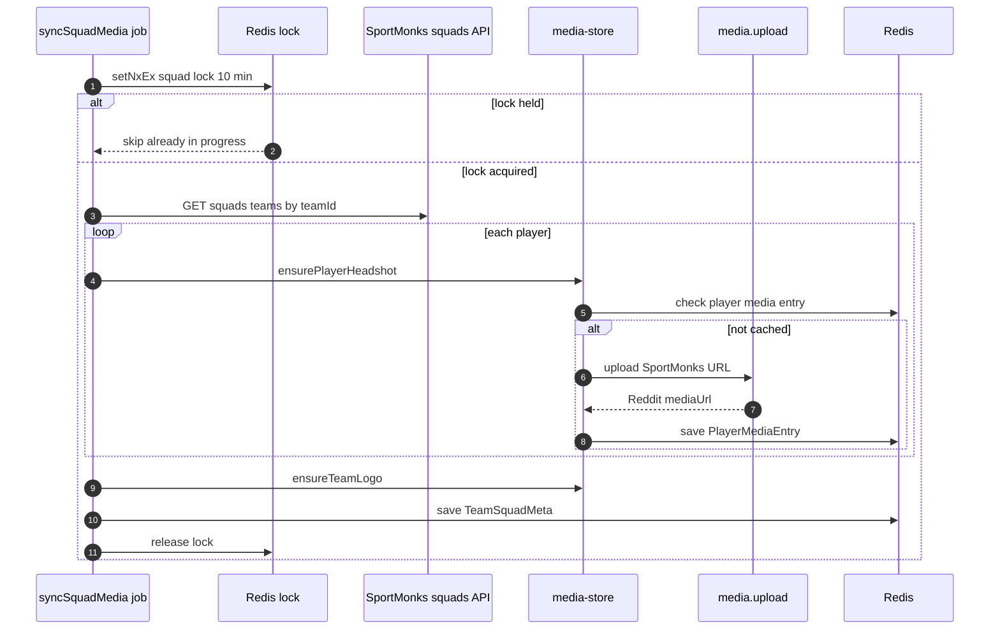

### When uploads happen lazy vs bulk

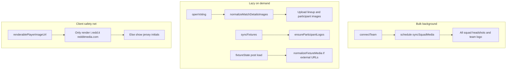

### Media triggers

| Trigger | When |
|--------|------|
| connectTeam | Schedules background syncSquadMedia |
| Mod menu | Sync squad photos force |
| openVoting | normalizeMatchDetailsImages |
| fixture load | normalizeFixtureMedia if external URLs remain |

### Media Redis keys

| Key pattern | Contents |
|-------------|----------|
| media cache by source URL hash | URL hash cache after media.upload |
| media team subredditId teamId | Team logo |
| media player subredditId playerId | Player headshot |
| media squad subredditId teamId | Squad sync metadata |

### Failure handling

| Failure | Behavior |
|--------|----------|
| media.upload fails | Log warning return undefined UI shows initials |
| Invalid source URL | Skip upload |
| Squad sync in progress | Second job skips lock |
| Corrupt URL cache JSON | Re-upload on next resolve |

---

## Mod menu

| Action | Description |
|--------|-------------|
| Schedule dashboard posts | Roll up all matches queue POTM and POTSeason at T+0 +3m +5m +10m |
| Create 3 recent match posts | Queue 3 match posts staggered every 5 minutes |
| Sync squad photos | Force squad headshot and logo upload to Reddit |
| Reset app data | Clear Redis and remove app posts |

---

## Scheduler

| Task | Schedule | Endpoint |
|------|----------|----------|
| syncFixtures | Mon 03:00 UTC | /internal/scheduler/sync-fixtures |
| lifecycleTick | every 1 min | /internal/scheduler/lifecycle-tick |
| closeVoting | one-off at votingClosedAt | /internal/scheduler/close-voting |
| publishMatchPost | one-off demo | /internal/scheduler/publish-match-post |
| publishPeriodPost | one-off demo | /internal/scheduler/publish-period-post |
| syncSquadMedia | one-off | /internal/scheduler/sync-squad-media |

---

## Setup

### Prerequisites

- Node.js 18+
- [Devvit CLI](https://developers.reddit.com/docs/devvit_cli)
- SportMonks API token

### Install and configure

```bash
cd match-review-app
npm install
npm run build

npx devvit settings set sportmonksApiToken YOUR_TOKEN

npx devvit upload
npx devvit playtest
```

On install moderators enter **Team name** e.g. Manchester City. The app validates via SportMonks search and stores the resolved team ID in Redis.

### Dev subreddit

Configured in devvit.json:

```json
"dev": {
  "subreddit": "match_review_dev"
}
```

---

## Project structure

```
match-review-app/
├── devvit.json
├── assets/icon.png
├── src/
│   ├── client/
│   ├── server/
│   └── shared/
└── docs/
```

### Key server files

| File | Role |
|------|------|
| src/server/store/match-review-store.ts | Core store lifecycle aggregation scheduling |
| src/server/services/sportmonks/client.ts | SportMonks API tiered fetch |
| src/server/services/sportmonks/resolve-team.ts | Team name search on install |
| src/server/services/media/normalize-media.ts | media.upload and URL hash cache |
| src/server/services/media/media-store.ts | Team and player entity cache |
| src/server/services/media/sync-squad-media.ts | Bulk squad sync lock and skip |
| src/server/services/media/normalize-fixture-media.ts | Fixture lineup image swap |
| src/client/utils/mediaUrl.ts | Client Reddit URL filter |

---

## Permissions

```json
{
  "redis": true,
  "reddit": true,
  "media": true,
  "http": {
    "enable": true,
    "domains": ["api.sportmonks.com", "cdn.sportmonks.com"]
  }
}
```

---
